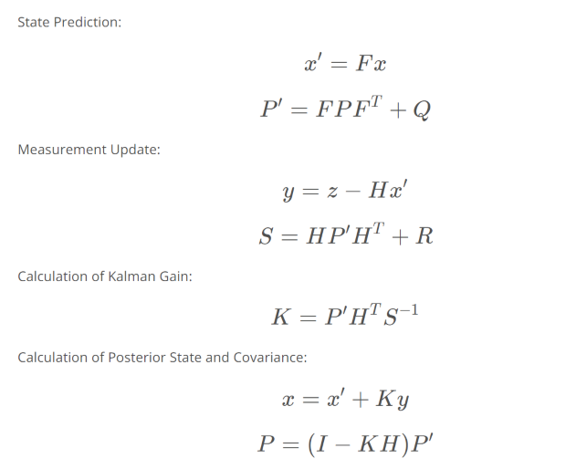

# Multi-Dimentional Kalman Filters

## Kalman Filter Equations

`P: State Covariance (Uncertainty)`  
`F: State Function`  
`H: Measurement Function`  
`R: Measurement Uncertainty`  
`I: Identity Matrix`  
`Q: Noise`  
`K: Kalman Gain`

## Eigen

For running this sample code you need to use eigen library  
[Eigen](http://eigen.tuxfamily.org/index.php?title=Main_Page#Download)

configure Eigen for visual studio  
[Eigen on Visual Studio](https://www.youtube.com/watch?v=6mMjv-tA5Jk)
