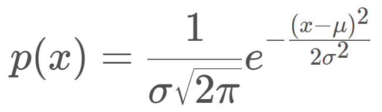
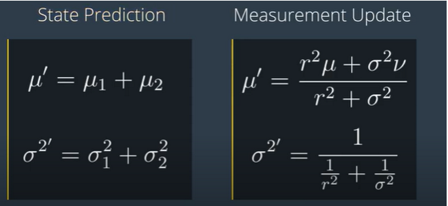

# Kalman Filter

At the basis of the Kalman Filter is the Gaussian distribution, sometimes referred to as a bell curve or normal distribution

## Mean and Variance

A Gaussian is characterized by two parameters - its mean (μ) and its variance (σ²). The mean is the most probable occurrence and lies at the centre of the function, and the variance relates to the width of the curve. The term unimodal implies a single peak present in the distribution.
Gaussian distributions are frequently abbreviated as N(x: μ, σ²).

Kalman filter assumes gaussian distribution plus linear movements of the object. In this scenario we know the initial or prior state of an object (mean and variance).  
i.e:
If prior belief (mean:20 and variance: 9) it means the object state might have 9 meters error.

`in summary a new state is estimated (for example move with mean:20m and variance: 9m) then apply the measurement(mean:30, variance:3) to calculate the corerect state. This new state is called Posterior state (mean:27.5, variance:2.25)`

in 1D Formula are as follows:

