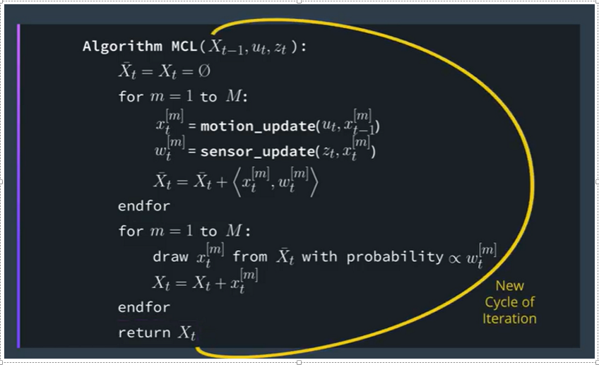

# Monte Carlo Localization for Mobile Robots

Mobile robot localization is the problem of determining a robot’s pose from sensor data.  
MCL algorithms represent a robot’s belief by a set of weighted hypotheses (samples), which approximate the posterior under a common Bayesian formulation of the localization problem

This is the most popular localization algorithm for robotics.  
Assuming your robot is navigating in its known map and collecting sensor information using range finder sensor, it then uses these sensor measured data to keep track of the robot pose

`MCL is also known as Particle Filter Localization. Given a map of the environment, the algorithm estimates the position and orientation of a robot as it moves and senses the environment. The algorithm uses a particle filter to represent the distribution of likely states, with each particle representing a possible state. The algorithm typically starts with a uniform random distribution of particles over the configuration space, meaning the robot has no information about where it is and assumes it is equally likely to be at any point in space. Whenever the robot moves, it shifts the particles to predict its new state after the movement. Whenever the robot senses something, the particles are resampled based on recursive Bayesian estimation. Ultimately, the particles should converge towards the actual position of the robot.`

# Localization Problems

Local(initial robot pose is known)
Global(initial robot pose is unknown)
Kidnapped Robot(during operation, robot can get kidnapped and
teleoperated to some other location)

MCL can solve the local and global robot problems

## How is MCL different from other localization algorithms?

MCL uses particles to localize the robot pose  
MCL can approximate almost any state space distribution

## MCL vs EKF

|                             |         MCL         |         EKF         |
| --------------------------- | :-----------------: | :-----------------: |
| Measurments                 |  Raw Measurements   |      Landmarks      |
| Measurement Noise           |         Any         |      Gaussian       |
| Posterior                   |      Particles      |      Gaussian       |
| Efficiency(memory)          |          ✔          |         ✔✔          |
| Efficiency(time)            |          ✔          |         ✔✔          |
| Ease of Implementation      |         ✔✔          |          ✔          |
| Resolution                  |          ✔          |         ✔✔          |
| Robostness                  |         ✔✔          |          X          |
| Memory & Resolution Control |         Yes         |         No          |
| Global Localization         |         Yes         |         No          |
| State Space                 | Multimodel Discrete | Unimodel Continuous |

## What is Weights in Particle Filter (MCL)

It is assigned based on i.e: the difference between robot actual pose and particle predicted pose.  
Particles with more weights have more chances to be preserved than
the the others

## MCL Algorithm

1. Motion and Sensing (move the robot and measure the distance to landmark)
2. Noise(add noise to measurements)
3. Particle Filters
4. Importance Weight (Evaluate the importance of particles)
5. Resampling
6. Error(quality of the overall solution)
7. Graphing

In nutshell the above algorithm steps are as follows:

1. Previous belief
2. Motion Update
3. Measurments Update
4. Resampling
5. New Belief
