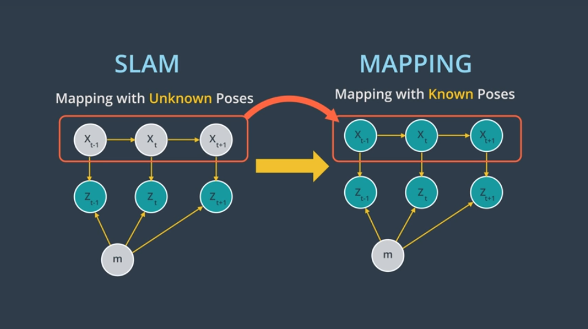
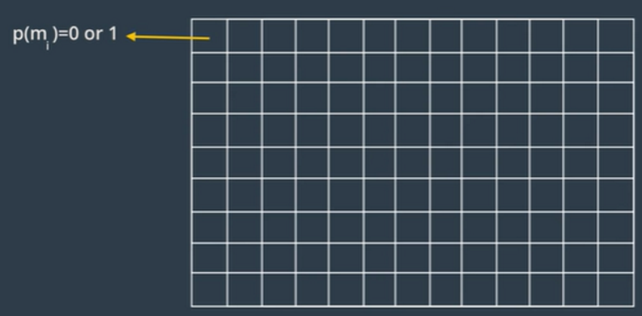
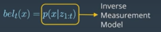
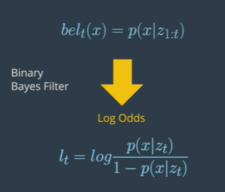
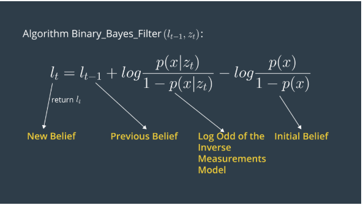
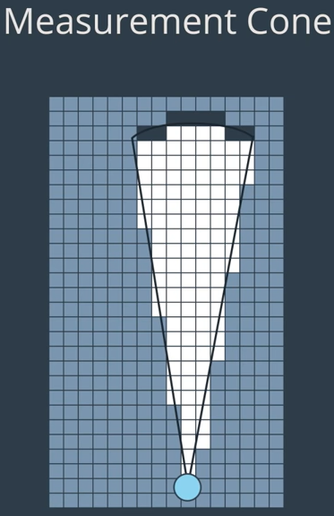
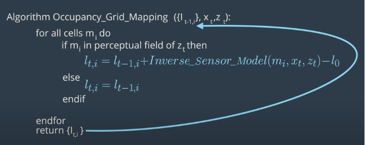
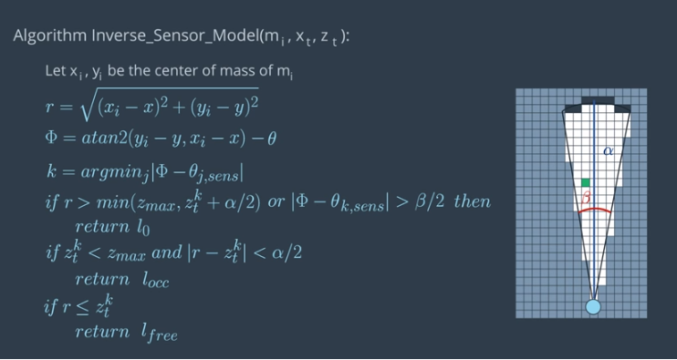
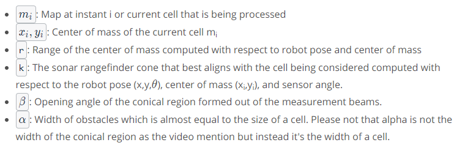

# Occupancy Grid Mapping

The problem of Generating map inside an unknown environment is called mapping

## Mapping with known poses

In most robotics application odometry data are noisy and robot poses are unknown to us.  
Mapping usually happens after slam but power of mapping is in its post processing.  
In slam problem changes in mapping with known poses to mapping with unknown poses. During the slam robot builds a map of environment and localize itself right after it, After slam, the ocuupancy grid mapping algorithm uses the exact robot poses filtered from slam then with the known poses from slam and noisy measurements the mapping algorithm generates a map fit for path planning and navigation

## How occupancy Grid Mapping uses Binary Bays Algorithm

The Mapping with Known Poses problem can be represented with P(m∣z1:t​,x1:t​)function. With this function, we can compute the posterior over the map given all the measurements up to time t and all the poses up to time t represented by the robot trajectory.  
What we are solving here is a binary estimation problem in which grid cell holds the static state that do not change over time.

There exist a filter to address the above calculations which is called Binary Bays Algorithm

## Binary Bays Algorithm

It solves the static problem by getting the log odds ratio of the belief. With static states the belief is a function of the measurements only

`The inverse measurement model is generally used when measurements are more complex than the system's state.`

The following is the Log odds representation

The algorithm for calculating the Binary Bays Filter is as follows:

The Binary Bays filter algorithm computes the log odds of the posterior belief denoted by lt. initially, then filter the previous log odds ratio of the belief `t-1` and the measurements `zt` as parameters

### Computation

Then, the filter computes the new posterior belief of the system lt by aading the previous belief `lt-1` to the log odds ratio of the inverse measuremen model and substracting the prior probablity state also known by initial belief. The initial belief represents the initial state of the system before taking any sensor measurements into concideration

### Output

Finally the algorithm returns the posterior belief of the system `lt` and a new iteration cycle begins

### Occupancy Grid Algorithm

Goal is to calculate the occupancy value of each cell  
The cells that fall under the following measurements cone are highlighted in white and black color. When looping through all cells the algorithm will concider those white and black cell of the cells falling under the preceptual field of measurements

The algorithm works as follows:

## Steps to create a sample code

- Generate a grid (size 300 x 150) and loop through all the cells
- Inside the loop, compute the center of mass of each cell xi and yi
- Inside the loop, check if each cell falls under the perceptual field of the measurements

## Summary of notaions for the sensor rangefinder inverse sensor model

